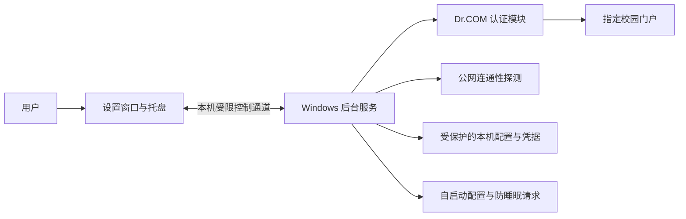
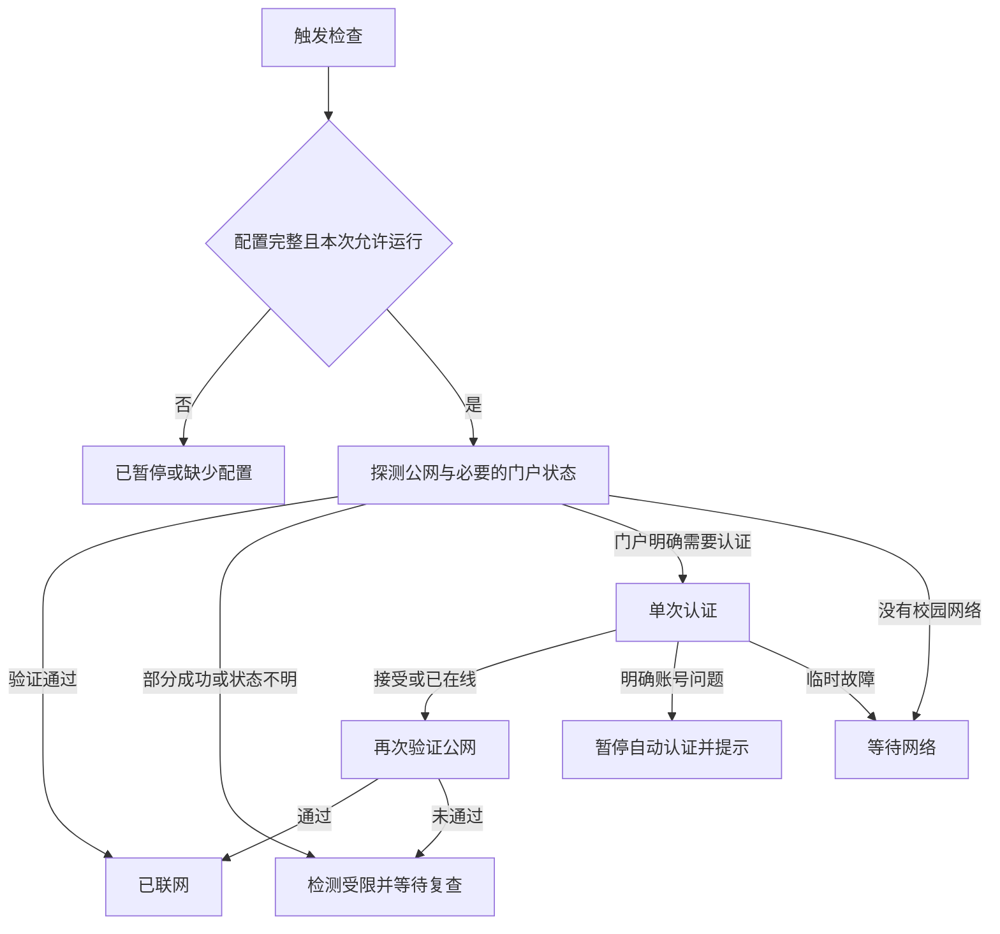

# CampusPulse 开发设计文档

文档版本：1.0 · 更新：2026-09-30 · 目标软件版本：0.1.0-preview.1

**本文描述待实现的设计，不是功能完成或实测通过证明。** 当前阶段先完成文档，再按文档开发。

接手时先读 [项目进度与下一步](HANDOFF.md)；实际执行证据统一记录在 [验证记录](VALIDATION-LOG.md)，避免把设计能力当成已实现能力。

## 1. 产品目标与成功标准

CampusPulse 是面向 Windows 的校园网自动认证工具。用户在本机填写一次自己的校园网账号后，软件在网络恢复时自动完成认证，适合笔记本持续插电、开盖、长期无人操作的场景。

核心目标：校园网夜间停网，次日恢复供网且认证服务可用后，电脑能自动恢复互联网连接。

成功标准：在无人操作的情况下完成必要认证，并通过独立的公网连通性验证。页面返回 HTTP 200、网卡显示已连接、认证接口返回成功，均不能单独视为互联网已经恢复。

用户已明确取消 UU 远程测试；远程软件状态不属于本项目的验收条件。

## 2. 已确认的使用环境与边界

- 首版平台：Windows 11 x64，Intel/AMD 64 位电脑。
- 设备场景：笔记本持续插电、盖子打开；宿舍不会夜间断电。
- 接入方式：有线校园网；每晚 23:30 断开，早上恢复时间未知。
- 默认门户地址：`http://10.62.164.38/`；使用者可自行填写校内 HTTP IPv4 门户首页。旧地址 `10.62.164.14` 于 2026-09-29 返回指向该地址的跳转页，不能作为当前认证首页。
- 门户页面实际下拉项：中国联通、中国移动、中国电信、校内网（无外网）；用户自己的账号选择电信。用户确认没有验证码、短信或扫码。
- 产品形式：中文设置窗口、托盘、独立后台服务、可分享的安装包。
- 分发方式：GitHub 公开源码，Releases 提供安装包；每位使用者填写自己的账号。
- 当前适配范围：校内私有 IPv4 地址上的相同 Dr.COM 页面、配置和登录接口；其他学校的不同协议、域名门户、HTTPS 门户及不同路径尚未适配。新增四个选项和自填地址只有离线模拟证据，不能宣称跨校可用。
- 单机一个共享的校园网配置；不在首版实现多个 Windows 用户的独立校园账号切换。

### 2.1 已取得的证据

只读读取 `http://10.62.164.14/` 时，首页脚本中的旧 `carrier` 配置仍含 `@dx`、`@lt`。继续沿 `page/loadConfig` 读取浏览器实际加载的 `pc.js` 模板，确认截图中四项的提交值依次为 `@unicom`、`@cmcc`、`@telecom`、空值。当前网页使用 `/eportal/portal/login` 流程；首页旧 `ACSetting` 和旧 `carrier` 字段均不能代替实际模板。这些读取没有提交密码。

2026-09-29 重新只读检查时，`10.62.164.14` 的首页及状态路径均返回 451 字节跳转页，目标为 `10.62.164.38/a79.htm`，其查询参数值未记录；用户浏览器截图确认该地址显示中国电信等登录选项。以 `http://10.62.164.38/` 为受支持首页执行绑定物理有线网卡的只读检查，页面、配置、选中运营商模板及状态均通过，结果为 `authentication_required`。新主机的 `/a40.js` 响应声明 `Content-Encoding: gzip`；解压后脚本版本可解析为 `4.2.1`。这些证据仍不证明真实认证成功。设置中只填首页 `http://10.62.164.38/`，不填浏览器的 `/a79.htm` 路径或动态参数；已有配置改地址时必须在本机重新输入密码。

本机曾只读检查到插电空闲 5 分钟自动睡眠，支持 Modern Standby，休眠当时未启用。这是检查时的状态，不是本产品的固定环境假设，也没有据此修改用户的电源设置。

### 2.2 尚未取得的证据

2026-09-29 用户在本机正式窗口手动触发一次真实认证，后台随后记录两项公网探测通过，独立有线公网检查也通过；这是一项手动登录证据，没有跨夜自动恢复记录。当前代码已完成 27 项模拟测试和 Release 构建；本轮仅刷新临时后台自包含副本，最终安装包没有重新打包，也没有成功安装、升级或卸载结果。不能把单次手动登录写成自动重连或跨夜验收通过。

## 3. 第一版功能需求

### FR-01 首次配置

提供账号、密码、运营商选择和校园门户首页地址输入。默认地址为 `http://10.62.164.38/`；当前只接受校内私有 IPv4 的 HTTP 首页，不接受账号参数、其他路径或端口。用户名去除首尾空白并限制长度，密码保留原始字符，不能 trim、截断或自动改写。使用专用密码输入控件，保存后清空输入框。

首次安装不预置账号密码，自动重连默认关闭。用户主动保存并启用后才允许提交认证。不存在可用凭据时显示“请先配置账号密码”，不对门户发送空账号尝试。

账号输入按不带运营商后缀的基础账号处理；也允许粘贴一个与所选选项一致的完整账号，规范化后仅追加一次。其他或重复后缀应提示修正。更换账号、运营商或门户地址视为更换认证身份，必须重新输入密码；旧预览配置的密码不能直接用于新版后缀。

### FR-02 三个独立开关

**开机自动运行 `StartWithWindows`：默认开启。**

- 控制后台服务下次开机是否启动，不控制设置窗口是否弹出。
- 开启时采用 Windows 服务的自动延迟启动；不依赖用户登录桌面。
- 关闭时改为“手动启动”，不能设为“禁用”。当前服务继续运行，不影响当前联网。
- 手动打开软件时，如果后台尚未运行，提供“启动后台服务”操作，通过 Windows 服务管理器启动后重新连接。
- 保存后必须核对系统服务配置；不能只修改界面复选框或本地 JSON。
- 设置窗口不注册独立的开机计划任务，避免与这个开关含义冲突。

**自动重连 `Enabled`：默认关闭。**

- 开启且凭据完整后，启动周期检查和必要的登录操作。
- 关闭后取消下一次自动认证，保留设置和凭据，显示“已暂停”。
- “立即检测”只检查网络与门户状态，不提交密码；“立即重连”才允许一次必要的人工触发认证，两者均不改变自动重连开关。
- 暂停必须阻止任何新的登录请求；对已在途请求发出取消信号，但不宣称能撤回服务器已经收到的请求。

**无人值守模式 `UnattendedMode`：默认关闭。**

- 用户开启后，后台运行且接通交流电时持有防空闲睡眠请求，允许息屏与锁屏。
- 此开关独立于自动重连；暂停重连不隐式关闭值守模式，界面持续显示“防睡眠生效中”。
- 关闭模式、切换到电池、停止服务或卸载时释放请求；重新插电且开关仍开启时恢复请求。
- 不永久修改 Windows 电源计划，不阻止用户主动睡眠、关机或合盖操作。
- 防睡眠请求失败要明确提示；不能只凭配置值显示“正在保持唤醒”。

### FR-03 自动检查与恢复

开机、网卡地址或连接状态变化、从睡眠恢复、用户点击立即检测或重连时触发对应工作。即使网卡与 IP 没有变化，也保留低频检查，覆盖认证静默过期。

恢复时间不写死。23:30 仅是已知业务背景，不作为固定停机命令或全天唯一触发时间。

### FR-04 状态与操作

界面显示：当前联网状态、后台服务状态、上次检查时间、上次公网验证成功时间、预计下次检查时间、最近的脱敏事件、防睡眠实际状态。

凭据提示以后台快照为依据。首次读取时显示正在读取；后台未连接时显示暂无法确认已保存凭据状态，不因断连声称密码丢失。诊断复制使用共享的事件文本生成函数，仅包含时间和后台固定脱敏消息，不附带配置或认证请求。

提供：保存设置、立即检测、立即重连、暂停自动重连、启动/停止后台服务、清除已保存凭据。清除凭据时暂停重连，避免继续使用旧密码；其余两个开关保持不变。停止后台服务时明确说明重连和防睡眠都会暂时结束。

关闭窗口收起到托盘；退出托盘只退出界面，后台继续按配置运行。首次执行退出时说明该行为，避免用户误认为已经停止服务。

### FR-05 错误与重试

- 无网线、没有有效地址、门户暂时不可达：等待恢复并间隔重试。
- 认证服务暂时故障或限流：延长间隔，尊重可信的重试提示并限制最大等待时间。
- 明确的账号密码错误、欠费或账号受限：显示分类提示，停止自动提交凭据，直到用户更改配置或主动重试。
- 无法识别的响应：按未知问题显示，不能猜测为密码错误或登录成功。
- 门户认证成功但公网验证失败：进入“互联网尚未验证可用”，继续验证；不得持续重复提交同一凭据。
- 不支持的认证配置、门户身份不匹配：停止认证，保留可读原因。

## 4. 技术架构

用户同意参考 Campus-Flow 的功能。逐项取舍见 [功能参考对照](REFERENCE-FEATURES.md)，涵盖静默后台、设置、自启、参数、密码、日志、网络事件和状态呈现；参考功能不等于直接复制代码或沿用其成功判定。

选择 C#、.NET 10 LTS、WPF、Windows Service、Inno Setup。运行环境随安装包分发。依据见文末官方资料；开发时固定 SDK 和依赖版本，更新后重新构建与验证。

### 4.1 Core：协议与决策

`CampusPulse.Core` 负责校园门户识别、受支持配置解析、请求构造、结果分类、连通性验证、退避计算及共享数据模型。不负责凭据落盘，不直接启动进程，不依赖窗口。

HTTP 客户端和时钟可以替换为测试实现。离线测试可覆盖错误响应、特殊字符、重定向与时序，不需要真实账号或校园内网。

### 4.2 Service：执行与存储

`CampusPulse.Service` 负责串行检查、触发合并、定时器、密码加解密、状态快照、有限事件记录、服务自启配置和电源请求。

0.1 版采用 LocalSystem 服务身份，以便在登录前运行并管理自身启动类型。这个身份权限较大，因此服务只接受固定命令，网络目标和文件位置使用明确的允许范围，不提供执行任意命令、加载外部脚本或读写任意路径的接口。后续若拆出受限权限服务，应重新设计权限边界。

服务崩溃由 Windows 恢复策略有限重启：依次等待 5、15、60 秒，第四项为不操作（NONE），无故障 86400 秒后重置计数。Windows 会重复列表末项，所以不能以重启作为末项。配置损坏或凭据不可解密时，以暂停状态启动，不能启动失败后反复盲目认证。

### 4.3 App：管理员设置与状态

`CampusPulse.App` 是 WPF 程序，托盘使用系统通知区域。首版配置操作需要管理员权限，启动设置窗口时允许出现 Windows 权限提示；普通非管理员用户需要管理员协助安装和配置。这是首版的明确使用限制。

界面不持久保存密码、不回读旧密码、不执行认证。密码仅为保存请求短暂进入内存，完成后清空控件；不承诺托管内存中不存在任何瞬时副本。

后台服务不直接显示窗口；设置程序与服务分进程通信。服务可运行而设置窗口不存在。

### 4.4 Installer：机器级安装

安装包负责安装运行文件、建立受保护数据目录、注册服务和快捷方式。首次安装后台可启动但处于未配置/暂停状态，不会因为安装完成自动提交账号。

升级保留账号配置、三个开关和数据目录权限。不得把用户关闭的开机自启重新打开。安装器与实际服务启动类型必须保持一致。

## 5. 登录适配设计

### 5.1 当前网页流程的只读证据

只读查看首页、加载配置、`a43.js` 和实际加载的 `pc.js` 后，目前观察到：

- 门户类型：Dr.COM。
- 配置包含 `login_method=1`、`account_prefix=1`、`en_md5=0`、`password_cut=0`。
- 当前网页认证目标为默认门户主机的 801 端口 `/eportal/portal/login`。
- 当前网页使用 JSONP GET 方式，账号字段为 `user_account`，密码字段为 `user_password`。
- 账号按网页规则组合前缀、基础账号及所选模板后缀；已观察到的前缀为 `,0,`，实际模板后缀为联通 `@unicom`、移动 `@cmcc`、电信 `@telecom`、校内网空值。首页旧 `carrier` 字段的 `@dx` 和 `@lt` 不能用于当前模板。
- 终端参数包括 `wlan_user_ip`、`wlan_user_ipv6`、`wlan_user_mac`、`wlan_ac_ip`、`wlan_ac_name` 和 `jsVersion`。

这些结论来自网页和脚本静态读取，不等于接口已接受过本工具的请求。实现前按当时的页面重新确认；页面变化要暂停适配，不能继续使用未经验证的兼容接口。

### 5.2 参数构造与目标约束

用户输入的地址先规范化为私有 IPv4 的 HTTP 首页；拒绝本机、链路本地、公网 IP、域名、用户信息、查询、其他路径、其他端口及 HTTPS。服务只对该主机的固定 Dr.COM 路径和固定公网探测来源发起请求；认证前验证 Dr.COM 标识、加载配置与实际 `pc.js` 模板中 `ISP_select` 下拉框的所选后缀。其他下拉框的同名选项和重复后缀不能授权提交凭据。主页即使返回 200，但身份不匹配，也不能发送凭据。输入其他学校的地址不代表该校协议已适配。

每次认证获取当前终端参数，不能把开发者当时的内网 IP、MAC、AC 名称或账号写进代码。对页面提供的地址检查格式，并与当前有效网卡、到门户的路由关系核对；多网卡、VPN 或多条有效线路产生歧义时，返回诊断状态，不猜测要认证的终端。

公网探测与认证必须关联到同一条目标有线网络。选择与所填门户地址路由相符的有线接口并绑定相应源地址，必要时校验实际路由；无法确认时显示“网络路径不明确”。Wi-Fi、手机热点或 VPN 上网成功不能被记录为校园有线网恢复。校内网（无外网）选项按门户在线状态单独显示，不能算作公网恢复。

当前 Windows 实现枚举已连接的物理以太网接口，用指定接口及源 IPv4 查询到门户的路由，而不依赖可能被 VPN/TUN 接管的全局最优路由。仅有一条有效物理路径时接受；多条或无有效路径时保守拒绝。公网探测的固定域名优先通过所选有线网卡配置的 DNS 服务器、绑定同一接口解析，并拒绝私有地址及代理软件常用的 `198.18.0.0/15` 假地址；系统 DNS 回退也只接受公网地址，实际连接继续绑定有线接口。DNS 或其中一个探测来源失败时不得据此提交密码。

使用规范的 URL 编码处理特殊字符，避免 `+`、`&`、`#` 等改变请求语义。密码不自动追加后缀、不截断、不做页面未要求的哈希变换。

JSONP 仅去掉经过校验的回调外壳后解析 JSON，禁止执行响应脚本。接受未压缩或单层 gzip 响应，按解压后字节数执行响应体大小上限；拒绝未知压缩格式、异常数据和未经验证的配置变更。

### 5.3 网络与凭据传输限制

认证客户端直连校园接口，不依赖系统 HTTP 代理；不自动修改用户 VPN 或路由。认证请求禁止跟随重定向，目标变化不能携带密码跳转。

学校当前页面使用 HTTP，客户端的本机加密保存不能让该学校接口变成 HTTPS。首版保持与学校实际流程兼容，并在文档中说明传输方式；不宣传端到端加密。任何日志、异常摘要和诊断导出都不得包含带密码的查询 URL。

### 5.4 公网验证

设计至少两种独立探测来源，校验预期状态码与内容；其中至少一种使用正确验证证书的 HTTPS。探测地址不包含账号或个人信息，具体来源在开发阶段于该校园出口验证后固化到探测配置。

- 两个来源均验证成功：状态为“已联网”，更新 `LastSuccess`。
- 一个成功、另一个失败：状态为“部分连通/检测受限”，显示部分证据，不能归类为密码错误，也不能仅因此重新认证。
- 两个均失败且门户明确需要认证：允许一次认证。
- 两个均失败但校园认证状态不明确：先确认门户状态；不能将“任何公网故障”直接等同“需要重新登录”。

不能仅用 ping、Windows 网络图标、HTTP 200 或页面包含“成功”二字判定联网。探测只能证明探测目标可达，不声称互联网所有站点均可访问。

### 5.5 认证后的保护窗口

门户接受认证后，先在短时窗口内复查公网，例如 2 秒、5 秒、15 秒。成功后结束本轮；仍失败则进入受限状态，至少 5 分钟内不因同一故障重新提交凭据，除非门户明确重新要求认证或用户主动重试。

“已经在线”响应作为再次验证公网的信号，不作为直接完成结果。终端地址变化后重新识别门户和终端，不复用旧认证参数。

## 6. 状态机与调度

主要状态：已暂停、缺少配置、正在检查、等待网络、正在认证、已联网、认证被拒绝、门户不可用、互联网检测受限。状态和原因代码分开保存，中文文案由固定映射生成，避免显示原始服务器错误内容。

调度初始值均是待测试的默认策略，不是已测性能承诺：

- 正常联网：每 120 秒检查一次；网络变化可唤醒调度，但不取消在途检查或提前绕过已排定的下次检查时间。
- 临时离线：按 30、60、120、300 秒退避，之后不超过 300 秒一轮，加入小幅随机延迟以减少集中请求。
- 事件唤醒：合并重复事件，普通网络事件遵守当前重试间隔，用户主动检查或重连可立即执行；自动认证之间保留至少 5 秒间隔，任何时刻最多一个认证在途。
- 单个 HTTP 请求：初始超时 8 秒；整个检查阶段有总时限，可被暂停、关闭服务取消。
- 凭据被拒绝：停止自动提交，网络变化和进程重启均不能自动解除该保护；用户修改凭据可重置保护，明确点击“立即重连”仅允许一次人工重试，单纯检测不解除保护。
- 服务启动：读取当前配置与错误保护状态；自动重连关闭时不进行自动认证。

夜间停网期间继续按退避节奏等待，不忙循环、不每秒持续重试。恢复检测延迟目标不超过最长重试间隔加一次认证验证周期，初始目标为约 6 分钟以内；需在真实校园网测试后才能写成实际性能结论。

## 7. 本地数据与控制接口

### 7.1 数据文件

路径固定为 `%ProgramData%\CampusPulse`，继承权限关闭，仅 SYSTEM 和本机管理员可访问。程序文件位于 `%ProgramFiles%\CampusPulse`，普通用户不能修改后台可执行文件。

- `settings.json`：配置版本、基础账号、运营商标识、门户首页地址、三个开关、检查间隔、持久化的认证暂停原因；不含密码。配置版本 2 将旧版本 1 的自动重连关闭，旧凭据不再用于新版运营商后缀；用户重新输入密码后才能恢复认证。
- `credentials.dat`：Windows DPAPI 加密的账号与密码绑定记录。更换账号时必须重新输入密码，不能把旧密码隐式用于新账号。
- `events.json`：最多 80 条脱敏事件，记录时间、固定状态与原因。持久化的上次公网成功时间可随此记录恢复。

JSON 写入采用同目录临时文件与原子替换，临时文件继承同样严格的权限。配置、凭据和系统启动类型涉及多处修改时，必须先校验全部输入；任何一步失败要回退到一致配置或返回明确失败，不能显示“已保存”但实际只生效一半。回滚时不重写内容未变的文件；即使配置恢复失败，也必须尝试凭据恢复，避免文件占用阻断旧凭据回滚。读取时用配置版本和账号绑定验证一致性，不一致则暂停。

日志避免每轮重复落盘，优先记录状态变化、关键操作和错误分类；保留最近 80 条且最长 7 天，按先达到的限制清理。界面可复制这些脱敏事件，不导出原始配置或通信内容。禁止保存明文密码、完整查询 URL、原始 HTTP 响应、终端 MAC、个人内网地址或可复用会话信息。清除凭据不等于退出校园网，首版不提供自动注销操作。

### 7.2 DPAPI 与权限

凭据由服务加密和解密，使用 `LocalMachine` 范围配合文件访问控制。不能由窗口使用 `CurrentUser` 加密后再要求不同身份的服务直接解密。

机器级 DPAPI 本身不能隔离同一电脑上的其他账号；如果密文泄露给本机其他进程，仅有 DPAPI 不足以保护它，因此目录、文件和备份的访问控制都是必需条件。本机管理员仍是受信任主体，不声称能抵御已取得管理员权限的软件。

### 7.3 控制通道

使用本机命名管道 `CampusPulse.Control.v1`，UTF-8、单行 JSON 请求与响应。

- 只允许 SYSTEM 和提升权限的管理员连接，拒绝网络登录身份；客户端使用本机目标。
- 不打开 HTTP 服务，不监听 TCP 控制端口。
- 限制单请求大小为 16 KiB，连接/读写设置超时，拒绝未知命令和超长字段。
- 管道不允许向客户端返回保存的密码或密文。
- 客户端使用受限模拟等级，服务端禁止执行客户端传来的路径或脚本。

拟定命令：

- `status`：只读返回状态快照和非密码配置，不触发登录。
- `save`：验证并保存设置；密码为空仅在原账号未改变且已有凭据时表示保留；更换账号必须提供新密码。
- `check`：合并为一次只读检测，不提交凭据，不改变自动重连或凭据错误保护。
- `reconnect`：立即检测后按需要执行一次认证；遇到此前明确的凭据错误时仅人工重试一次，结果仍需公网验证。
- `pause`：持久化关闭自动重连，取消本轮可取消工作，不改变开机自启和防睡眠开关。
- `deleteCredentials`：暂停重连、删除凭据并清空账号，保留其他偏好。

`startService` 和 `stopService` 不是管道命令：由管理员界面调用 Windows 服务管理器；后台停止时无法响应管道，不能让它启动自己。

`Contracts.cs` 已包含配置版本、认证暂停持久化字段和结构化错误码；`NetworkModels.cs` 表达部分连通状态。后续仍须用服务集成与真实校园网络证据验证这些字段的完整行为。

## 8. 电源管理与运行生命周期

服务通过 Windows 电源请求维持插电时的运行，不请求屏幕常亮。记录实际申请结果，监听电源变化；服务停止时清理请求和句柄。Modern Standby、电源策略与用户主动睡眠会影响结果，因此需要在实际设备验证。

开机自启动与防睡眠互相独立。关掉开机自启动后，下一次重启不会自动提供防睡眠保障；界面在保存时解释这一关系，不偷偷替用户重新打开自启动。

关闭自动重连但保留无人值守模式时，界面显示“自动重连已暂停，仍在防止睡眠”。完全停止后台服务同时结束防睡眠；重新启动后按保存的三个开关恢复。

服务启动类型由系统配置与本机设置双向核对。用户在 Windows 服务管理器中做的外部更改需要在界面显示差异，不能把 JSON 当成系统已经生效的事实。

## 9. 安装与开源发布设计

完整步骤和用例见 [测试与发布计划](TESTING-AND-RELEASE.md)。

- 安装包：`CampusPulse-Setup-0.1.0-preview.1.exe`，包含 x64 运行环境，安装时需要管理员权限。
- 安装/升级及卸载前核对同名服务 ImagePath 必须精确指向当前安装目录的 `Service\CampusPulse.Service.exe`；不同路径或附加参数时拒绝接管/停止/删除，不按服务名猜测归属。开发临时服务须由其专用脚本核对标记后单独移除。
- 同时保留源码、构建脚本和依赖版本；构建工具本身不进入仓库。
- 仓库拟为 `aaamqrx/CampusPulse`，用户已选择公开开源；当前尚未创建或推送。
- 许可证采用 MIT，独立实现；Campus-Flow 仅为功能参考，不把其代码直接复制进项目。
- GitHub Actions 构建与离线测试可自动执行，不能访问学校私有网段或代替真实登录验收。
- 初期生成草稿或预发布版本，记录测试证据后再晋升正式版。每个安装包附 SHA-256 校验值。
- Git 工作副本构建清单记录源提交、工作区是否有变更和 HEAD 标签；无 Git 的源码归档构建保留未知值，不伪造提交归属。公开包从干净发布标签重建，并对该包再次验证安装文件哈希和原生界面。
- 没有代码签名证书时如实标识“未签名”；校验值不等于可信发布者签名，不要求用户关闭安全软件。
- 第一版不自动下载并执行更新。通过 GitHub Releases 获取新安装包；以后设计自动更新时另行定义签名验证、回滚和供应链策略。

## 10. 开发步骤与交付条件

1. **文档基线**：完成本文、测试发布计划与 README，核对用户需求和接口边界；该阶段已完成。
2. **认证与探测核心**：重新确认只读门户配置，实现解析、编码、判断、退避及离线测试；先用模拟响应验证，不自动使用真实凭据。
3. **后台服务**：实现受保护存储、控制管道、自启动设置、防睡眠及状态机，验证无凭据运行。
4. **设置窗口**：实现中文表单、三个开关、后台启动、状态和脱敏事件，检查窗口缩放、托盘退出与密码输入行为。
5. **开发运行与校园网络验证**：先用 `scripts/check-dev.ps1` 构建并运行模拟测试，再以不依赖安装包的开发运行方式逐项检查窗口、后台和系统功能。由用户在本机填写账号，验证一次真实认证，再观察夜间失效与次日恢复；验收只看校园认证和公网恢复。系统服务功能如需临时注册，应核对范围并在测试后清理。
6. **最后打包与公开**：全部适用功能修改和验证完成后，重新生成 EXE 安装包，完成安装/升级/卸载及干净 Windows 环境测试；检查仓库敏感信息后再公开同步。旧预览包不作为本阶段交付物。

不以文件存在、编译通过或模拟响应通过代替实际联网结果。需要时间跨度的测试单独记录开始/结束时间和结论，不预先填写“通过”。

## 11. 当前项目状态

2026-10-01 已发布 [v0.1.0-preview.1](https://github.com/aaamqrx/CampusPulse/releases/tag/v0.1.0-preview.1)。最终包来自干净标签提交 `dd2dc1e`，四项目 Release 构建、30/30 离线检查通过；候选包路径拒绝 7 项、本机生命周期 35 项，最终包另有 15 项安装/文件/原生界面复验，公开附件下载校验一致。本机三开关/故障恢复/电源/睡眠/窗口/托盘/权限及两次开机均有范围明确的证据；恢复自启后后台在用户解锁前运行，不宣称早于所有账户会话。正式产品运行，原三个开关和凭据密文已恢复，受保护备份已清理。

09-29 单次手动认证有后台与独立有线证据；一晚跨夜按用户现场确认接受，夜间事件已轮转，不代表多夜稳定性。干净 Windows 不可用，测试 preview.0 采用本轮应用载荷，不证明历史旧代码迁移；其他机器/DPI、卸载后重启及完整失败矩阵未验证。完整 M5/稳定版尚未完成，Actions 自动发布未实现。SDK 10.0.203 已用于本次标签构建；最新进度以 HANDOFF、LOCAL-ACCEPTANCE 和 VALIDATION-LOG 的日期/证据为准。

## 12. 设计依据

以下为文档撰写时核对过的资料。实际校园协议依据为用户提供门户及其加载的网页脚本；本仓库只记录必要的非个人协议字段，不上传原始页面、会话或开发者的内网地址。

- [.NET 长期支持政策](https://dotnet.microsoft.com/en-us/platform/support/policy)
- [使用 .NET 创建 Windows Service](https://learn.microsoft.com/en-us/dotnet/core/extensions/windows-service)
- [服务与交互界面分离](https://learn.microsoft.com/en-us/windows/win32/services/interactive-services)
- [服务恢复列表末项会被重复执行](https://learn.microsoft.com/en-us/windows/win32/api/winsvc/ns-winsvc-service_failure_actionsw)
- [DPAPI 保护范围](https://learn.microsoft.com/en-us/dotnet/api/system.security.cryptography.dataprotectionscope?view=net-10.0)
- [Windows 电源请求行为与释放要求](https://learn.microsoft.com/en-us/windows/win32/api/winbase/nf-winbase-powersetrequest)
- [.NET 自包含发布](https://learn.microsoft.com/en-us/dotnet/core/deploying/)
- [Inno Setup 功能](https://jrsoftware.org/isinfo.php)
- [GitHub Releases](https://docs.github.com/en/repositories/releasing-projects-on-github/about-releases)
- [Campus-Flow 功能参考](https://github.com/zuijiu888/Campus-Flow)
